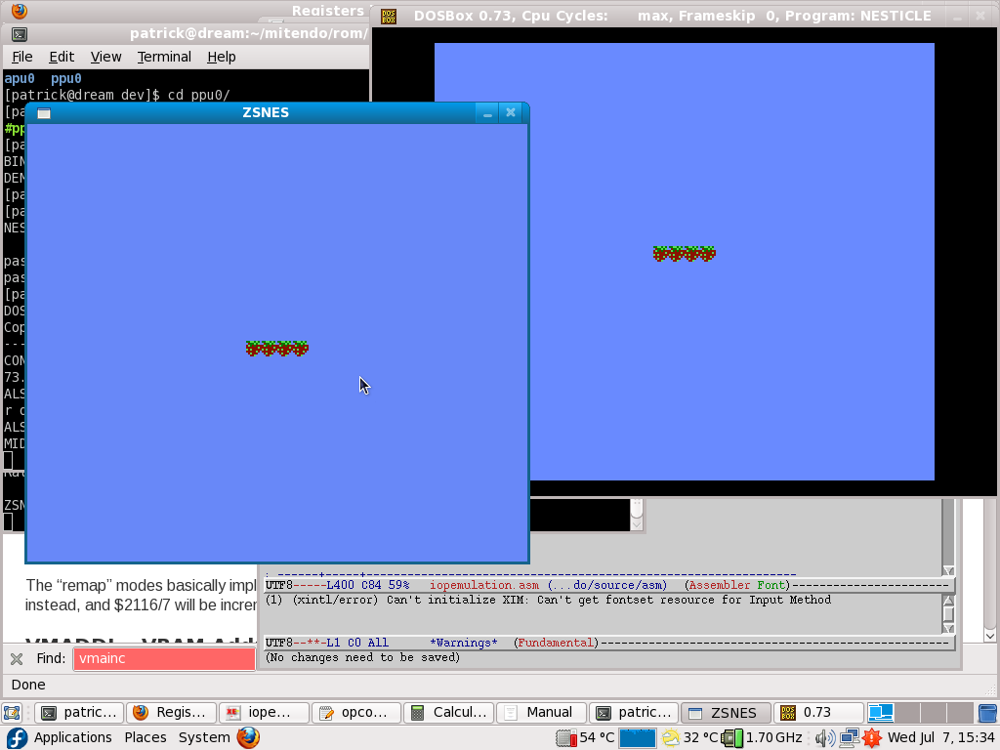
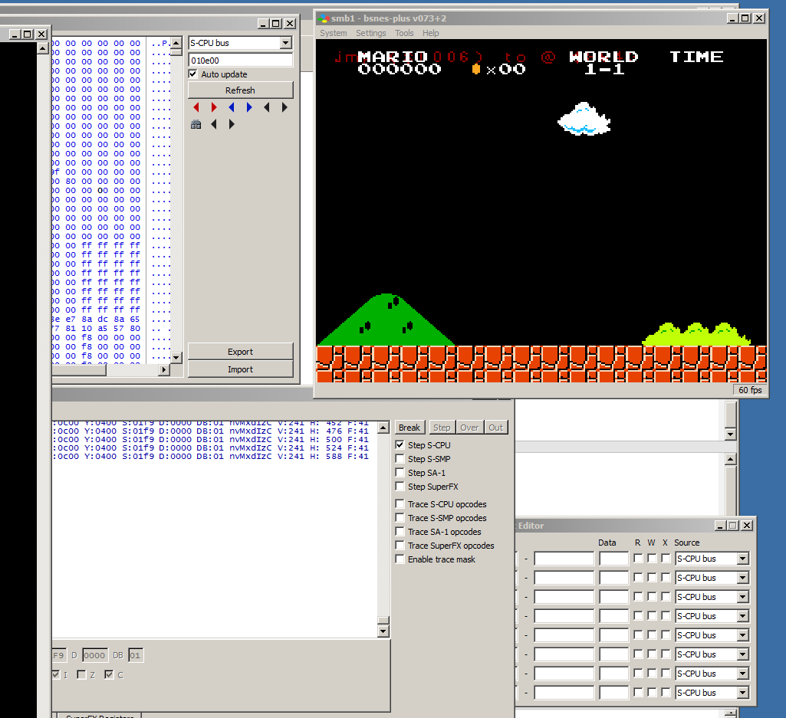

# upernes
A Nes to Super Nes recompiler.

upernes takes rom files for the Nintendo Nes and recompiles them to make Super Nes smc rom files.

It runs on linux and windows. A docker image can also be used.

## Principle:

The rom is disassembled, the tile data is separated. The 6502  machine code is analysed and stored in a list.
Once this list is made, the code is modified in order to replace read/writes to the original nes hardware by
calls to 65C816 assembler routines. Those calls emulate the nes hardware (PPU and sound). The memory is slightly reorganised, the data is taken from the original code in a first bank and the modified code runs from a second bank. Most of the original 6502 code is kept and runs
in emulation mode.
Upernes outputs an assembler file and converted tile data in outsrc, they must be copied in asm/ with "cpconversion.sh"
and compiled to a Snes rom with "wla-65816".
"wla-65816" puts everything back together to an smc file.

## Tricky modifications:

The indirect jumps cannot be detected by reading the ROM, they must be displayed on the SNES at runtime
when running into an unknown address. Then added manually to a txt file, and the
rom recompiled including the new indirect address.

The read/writes to the Nes hardware: replaced by 16 bit routines.

At start it looked tricky, but Memblers had already made the sound emulator.
And problem by problem it has been proven possible to make the conversion.

## How it is developed:

Very simple test roms each one targeting an hardware aspect are written in the directory "rom/nes/dev/".
Those roms are single test cases for things like background, scrolling, sprites, indirect jumps.
They are simple because in 2010 it was difficult to debug snes code.
The program is written in C++ and 65C816 assembler routines plus 6502 test roms. In order to develop upernes you need the "wla-65816" snes
assembler, nesasm, an snes emulator with debug functionality (like bsnes+). You may also need a software to edit nes
graphic data.
(check source/asm/memap.txt for information on code and data remaping)

## Status:

The disassembler, and instructions rewriting coded in C++ is more or less finished since 2011.
The emulated PPU is ok (games like in Battle city not working due to special tile sizes), it needs a good knowledge of what's going on in the consoles.
Basically, it converts "Super mario brothers" since 2016. The remaining work is: finish the PPU io emulation, The NSF player for SNES by Memblers is used but some adjustments on the line where it is called must be made in order to have proper sound.
add/fix interrupts.
And finally add comon bank switching for bigger roms (double dragon2 or SMB3 roms have complex bank switching and timers).
The emulation part is very tricky because not everything is at his original place, and the Snes cpu is not so much powerfull compared to the nes, you get an extra Mhz but that's it. So code in ram is often used to speed up port emulation calls. Unused nes address space in witch we find sram on the snes, is used to be able to execute code in the same bank. Hence avoiding bank switching and sparing cpu cycles.

## Tests:

T1 Palette   1

T2 PPU       1

T3 PPU       0

T4 PPU       0

T5 PPUScrol  0 scrolling ok

T6 PPUSprtie 0 too much sprites

T7 Pad0      0 color and backgorund error

T8 indjump   1 displays the adress


## Build upernes:

```
cd source; make
```

That's it for bulding.
## Windows installation:

Since the best snes debuggers are only available on windows, you may be interested in how to install
upernes on windows.

First install Msys2, it is the build environment, using gcc, make.
You must install the following modules from the Msys module installer:

    Make - Used to make upernes and to call wla-65816
    
    Gdb - Used to debug upernes (the disassembler/reassembler)
    
    SDL2 - if enabled to show the disassembly progress.
    
    Flex and Bison - Used to parse opcodes
    
You need to install wla-65816 from the web site. Wla-65816 is one of the best assemblers for retro gaming.
Add wla-65816 to your windows path (like adding C:\dev\snes\wladx_binaries_20040822\ to your $PATH)
I use FCEUX for the nes roms, and bsnes-plus for the snes roms, because they have a debugger.

 ## Docker Image

 The docker image is used to build everything without installing the tools directly on your system.
 The docker image is a Debian with bash, build-essentials, and wla-65816 assembler.
 You can build it with:
 
 ```
 cd docker/
 ./init_docker.sh
 ```

 But first you need to install docker, for linux, I suggest this link: https://docs.docker.com/engine/install/ubuntu/
 
 The docker container allows to build upernes as well as calling it to convert roms.
 Call ./docker/run_docker.sh and you will have a bash shell in the container at the current directory.

## How to build:

./build.sh will compile the nes test roms and the upernes binary.
If nesasm is not found, it will try running it with docker.
## How to use upernes:

Once everything is installed, go to the directory ./workdir/ and call:

```
./convert.sh "rompath/romname" "outputpath"
```

This script calls upernes on the nes rom file and disassembles it and rebuilds the graphic tables. It then makes copies
of the source code and ressources and builds the output rom using wla-65816.
Indirect jumps cannot be analysed until the jump address is known. Therefore the snes rom will stop on every missing
indirect jump adress and display the adress on a "crash" screen. You must add this address to romfilename.txt and call a new
convertion until all the indirect jumps are known.

### Use upernes with docker:

Same thing but in the root folder: ./convert.sh "rompath/romname" "outputpath"

## Some working roms:

Balloon fight, Pinball, Super Mario Brothers, Excite bike, Pacman, Donkey Kong (basically the simplest rom mapper)


## Tools used, & authors:

SPC700 APU emulator (c)2001-2003 Joey Parsell (Memblers http://membler-industries.com/) w/ assistance from Kevin Horton, and others

wla-65816 assembler by Ville Helin

NESASM3

the FCEUX comunity

NES Screen Tool by Shiru

Super Sleuth by Kris Bleakley (was the best emulator with debugger at the start of the project)

"bsnes-plus" based on Byuu's bsnes with improved debugging added by devinacker, undisbeliever and others.


upernes,(c)2015 Patrick Areny, upernes is released under the GPL licence.

my blog: http://www.blog.vreemdelabs.com/ <- Burnt in OVH fire in 2021 :( 

## Some screenshots:

### First development in 2010

The background tiles and palete test ROM being automaticly ported to SNES. The original on nesticle and the other one on Zsnes (fedora linux system)

### Just a month or two before SMB works in 2016

This is a screenshot of super mario brothers, with a background palette bug and an indirect jump address detection printed on the screen.
